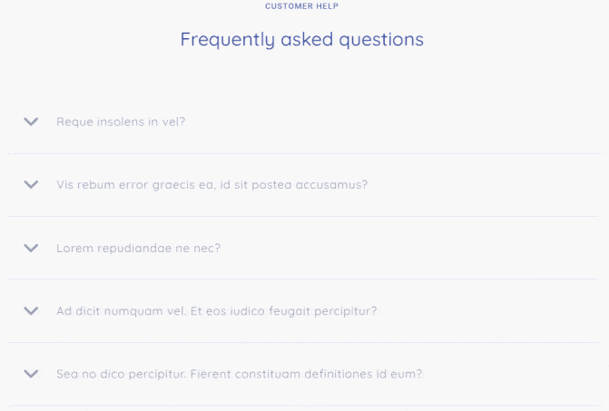

# Unnamed (landing page markup)

> :warning: **Warning!** All sliders on this page was be created on Vanilla JS (witout libraries). Sliders don't update, if you resize window. They can work wrong. For fix it you shoul reload page. After it sliders get actual data and will work correctly.

Deployed version: [tppd67421.github.io/unnamed](https://tppd67421.github.io/unnamed/)

## Technologies used

- Gulp;
- SASS.

## Project description

This project was be created from [dribbble template](https://dribbble.com/shots/4609742--Clean-and-simple-website-freebie). All featuries was be created with Vanilla JS, without any libraries. All elements have interactive and css transition (buttons, links, etc). Page responsive for all screens.

On mobile version has hamburger menu.

There is a button on the main screen that open modal window with video ad start him. Video stopped after close modal window.

All sliders was be created without library. First slider autoplay after each 4 sec. Second slider have infinity scroll.

Also was be created accordion menu in FAQ block.

